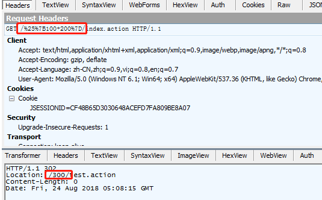
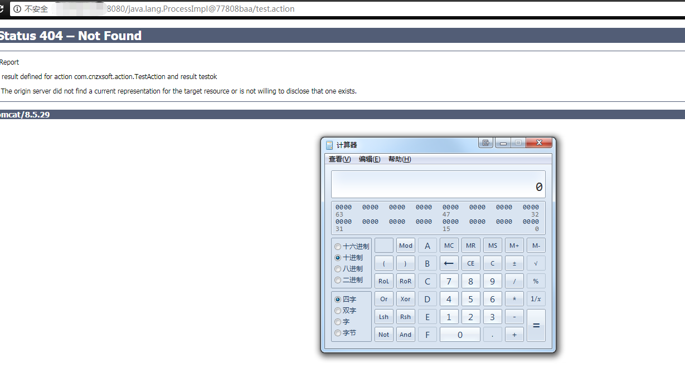
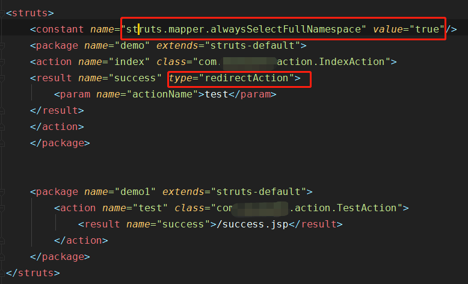
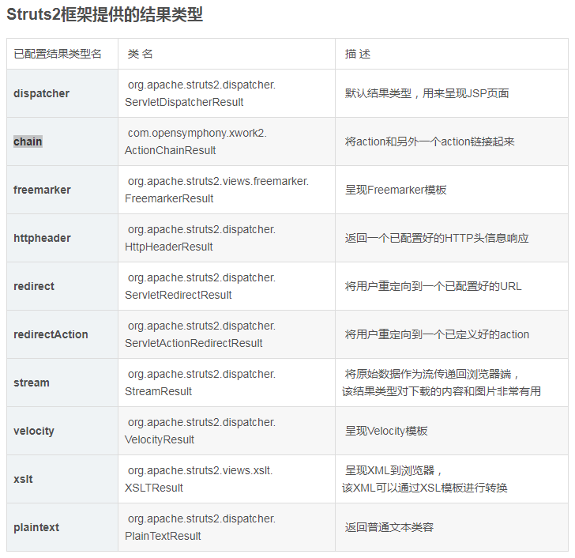
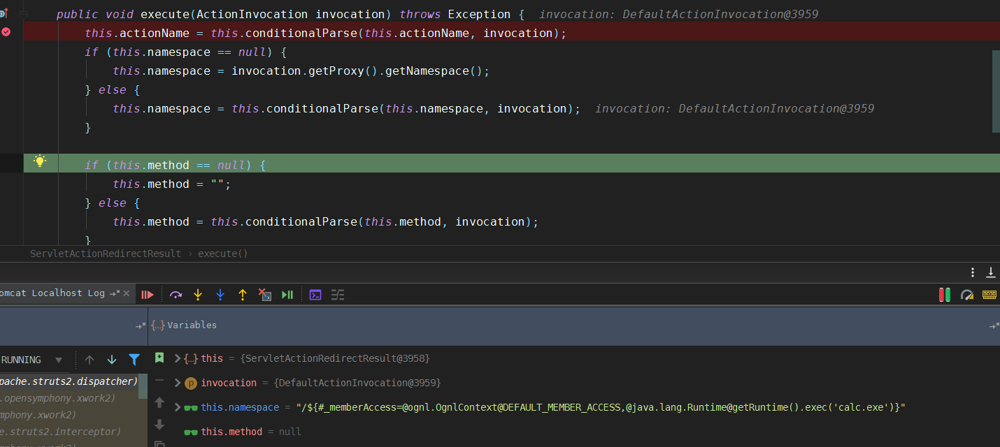
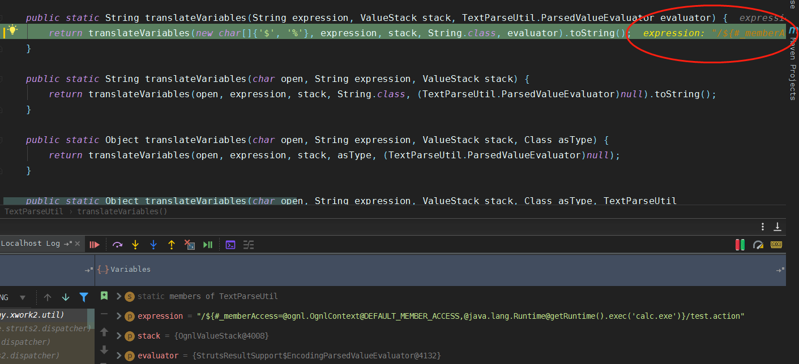
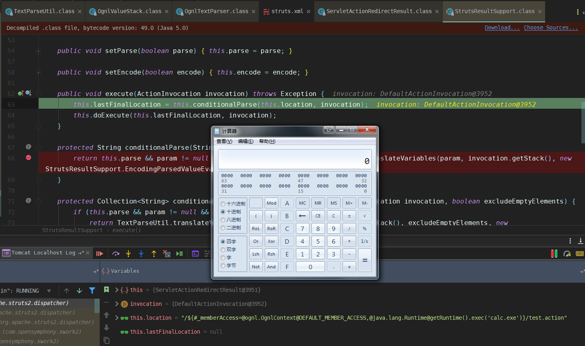
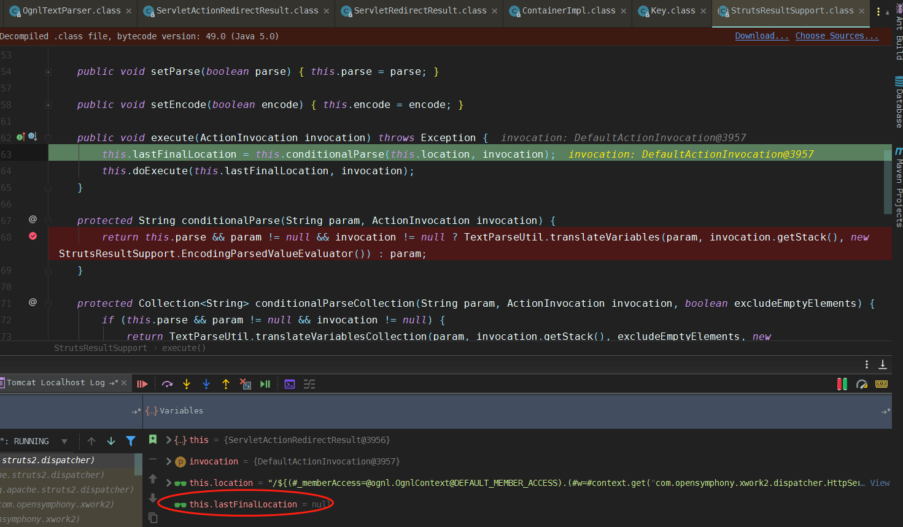
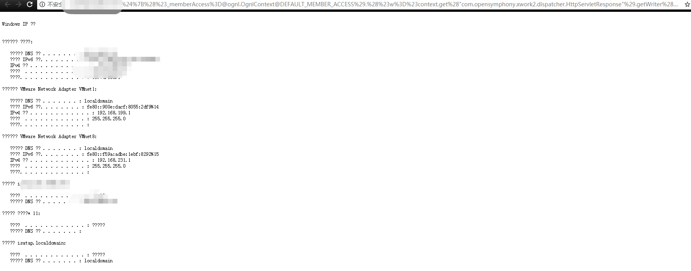

**Struts2-057/CVE-2018-11776远程代码执行漏洞分析（含EXP）**

**Ivan\@360云影实验室**

**2018年08月24日**

0x01 前言
=========

2018年8月22日，Apache Strust2发布最新安全公告，Apache
Struts2存在远程代码执行的高危漏洞（S2-057/CVE-2018-11776），该漏洞由Semmle
Security Research team的安全研究员Man
YueMo发现。该漏洞是由于在Struts2开发框架中使用namespace功能定义XML配置时，namespace值未被设置且在上层动作配置（Action
Configuration）中未设置或用通配符namespace，可能导致远程代码执行。同理，url标签未设置value和action值且上层动作未设置或用通配符namespace时也可能导致远程代码执行，经过笔者自建环境成功复现漏洞且可以执行命令回显，文末有你们想要的
!

0x02 漏洞利用
=============

笔者搭的环境是Strust2 2.3.20，漏洞利用大致分为三种方式：数值计算、弹出计算器、
命令回显。

2.1、数值计算
-------------

数值计算相对最简单，在URL上指定 %{100+200} 就可以发生跳转，得到计算的结果

2.2、弹出计算器
---------------

POC如下：

| /%24%7B%23_memberAccess%3D\@ognl.OgnlContext\@DEFAULT_MEMBER_ACCESS%2C\@java.lang.Runtime\@getRuntime%28%29.exec%28%27calc.exe%27%29%7D/index.action |
|------------------------------------------------------------------------------------------------------------------------------------------------------|

2.3、命令回显
-------------

利用com.opensymphony.xwork2.dispatcher.HttpServletResponse对象去打印命令执行后的回显数据，如下图

0X03 漏洞分析
=============

在分析漏洞之前，需要配置struts.xml文件，这个文件就是struts2的核心配置文件，大多数的时候增减配置都需要操控这里；

总共两处需要注意，第一处一定要配置struts.mapper.alwaysSelectFullNamespace = true
，否则不能触发漏洞，这个配置的目的是设定是否一直在最后一个斜线之前的任何位置选定NameSpace；第二处result标签返回的类型选择
“ redirectAction 或 chain“ ,
只有这两个配置选项的值是可以将action转发或者重定向；关于type具体可以参考下图

说完了配置，开始动态分析。漏洞位于
struts2-core.jar!/org/apache/struts2/dispatcher/ServletActionRedirectResult.class

This.namespace这个成员的值来自于getNamespace()方法，再通过getUriFromActionMapping()返回URI字符串；

通过getUriFromActionMapping获取的值赋给了tmpLocation变量，接着表达式进入setLocation方法

再通过super.execute方法调用了ServletActionResult ，
而在execute方法体内跟进了conditionalParse方法，在这个方法内调用了ONGL执行的关键方法translateVariables。

获得的param值传入到translateVariables()方法内，最终在OnglTextPaser里导致了OGNL表达式执行。

再弹出计算器后获得lastFinalLocation的值为当前执行后的句柄，这个值作为响应跳转的action地址
，也就是在浏览器中弹出计算器后在地址栏中出现的URI

到这里弹出计算器的分析到此为止，接下来看下基于命令执行回显结果的分析，基本上流程和上述一样，唯一不同之处lastFinalLocation返回的值是NULL，这也就引发出提交后没有做302的跳转，依旧是当前的action，并且返回的值是200

知道了原理后同事用python实现了exp检测脚本，此脚本用途仅供学习研究；

0x04 防御措施
=============

1.  将框架版本升级到官方最新版本；

2.  对于Web应用来说，尽量保证代码的安全性；

3.  对于IDS规则层面来说，数值计算和弹计算器返回的状态码都是302，并且Location跳转字段含有特征句柄字符串；如果是命令回显返回的200状态码，且有命令结果输出；

0x05 小结
=========

文章中提及的python EXP下载地址： <https://github.com/Ivan1ee> ；

0x06 参考链接
=============

<https://cwiki.apache.org/confluence/display/WW/S2-057>

<https://lgtm.com/blog/apache_struts_CVE-2018-11776>

<https://blog.csdn.net/madison__/article/details/55671426>
